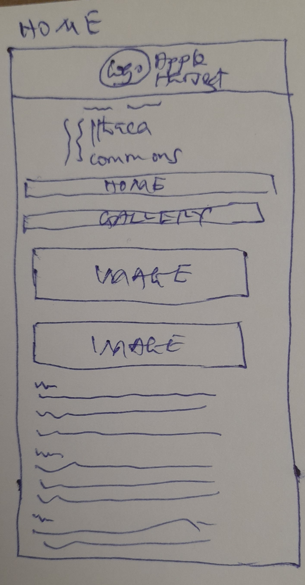
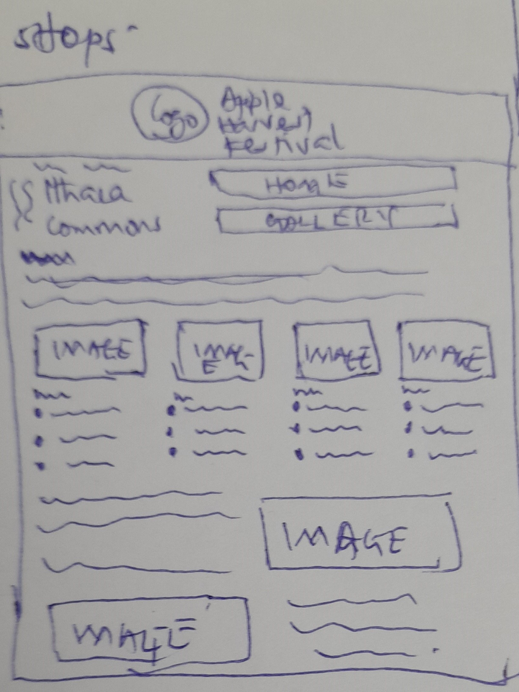

# Project 2: Design Journey

**For each milestone, complete only the sections that are labeled with that milestone.** Refine all sections before the final submission.

You are graded on your design process. If you later need to update your plan, **do not delete the original plan, leave it in place and append your new plan _below_ the original.** Then explain why you are changing your plan. Any time you update your plan, you're documenting your design process!

**Replace ALL _TODOs_ with your work.** (There should be no TODOs in the final submission.)

Be clear and concise in your writing. Bullets points are encouraged.

**Everything, including images, must be visible in _Markdown: Open Preview_.** If it's not visible in the Markdown preview, then we can't grade it. We also can't give you partial credit either. **Please make sure your design journey should is easy to read for the grader;** in Markdown preview the question _and_ answer should have a blank line between them.

## Understanding Users (Milestone 1)

**Make the case for your decisions using concepts from class, as well as other design principles, theories, examples, and cases from outside of class.**

You can use bullet points and lists, or full paragraphs, or a combo, whichever is appropriate. The writing should be solid draft quality but doesn't have to be fancy.

### User Interview Questions (Milestone 1)
> Plan the user interview which you'll use to identify the goals of your site's audience.
> You may use the interview template below and revise it as much as you desire.
> You are **required to author 3 of your own questions**.

**User Interview Briefing & Consent:** Hi, I am a student at Cornell University. I'm currently taking a class on web design and for a project, I am re-designing the website for Ithaca's Apple Harvest Festival. I'm trying to learn more about the people that might use this site. May I ask you a few questions? It will take about 10 minutes. You are free to quit at any time.

(These questions assume you are interviewing a festival attendee at the festival. If you didn't attend the festival, you may revise the questions and instead ask the participant to recall the last festival/event they attended. Do not ask them to speculate about visiting the Apple Harvest Festival. User speculation provides biased data.)

1. Please tell me a bit about yourself. You may omit any personal or private information.

2. What brought you to visit the Apple Harvest Festival today?

3. Before you came to the festival today, did you seek out any information about the festival before getting here?
3a. If yes, What information were you specifically looking for? Did you find it? How did you access that information?

4. When you arrived at the festival, did you seek out any information about the festival?
4a. If yes, What was that information? How did you obtain it?

5. Now that you're here participating in the festival, have you sought out information about the festival?
5a. If yes, what was the information and how did you obtain it?
6. Has there been anything you've encountered at the festival( relating to the festival) that you didn't expect? If yes, what? If yes, what impact did it have on your experience here?
7. Have you visited the Festival's website? If yes, when and why?
8. Did you find the information you were looking for? How long did it take to find?
9. How did you get here today?

...

n. What haven't I asked you today that you think would be valuable for me to know?

**After the interview:** This was really helpful. Thank you so much for agreeing to speak with me today. Have a great day!

### Interview Notes (Milestone 1)
> Interview at least 3 people from your audience. Take notes and include those notes here. Make sure to include a brief description of each interviewee.
> **Copy the interview questions above into each interviewee section below.**
> Take notes for each participant inline with the questions.

**Correction based on feedback of submission was made here. The corrections are in bold**

**Interviewee 1:**

Name: Reid

**Reid is a Cornell sophomore studying computer engineering. He lives in college town. He is white. He comes from Utah. He's lived in collegetown for about 2 months now. He's 20 years of age. He lives with his friend in an apartment at collegetown.**

Reid is a cornell sophomore studying computer engineering.

1. Please tell me a bit about yourself. You may omit any personal or private information.

    _I am a Cornell sophomore studying engineering and I am here to have fun this weekend._
    **I live in college town. I am 20 years. I come from Utah. I have lived in college town for about 2 months now.**

2. What brought you to visit the Apple Harvest Festival today?

    _I came here to hang around to have fun with friends, enjoy the food here, explore the shops, and try the donuts._

3. Before you came to the festival today, did you seek out any information about the festival before getting here?
3a. If yes, What information were you specifically looking for? Did you find it? How did you access that information?

    _I sought for the time, map, road availability, and I got the information from the festival's website_

4. When you arrived at the festival, did you seek out any information about the festival?
4a. If yes, What was that information? How did you obtain it?

    _To see the place, and I found good food_

5. Now that you're here participating in the festival, have you sought out information about the festival?
5a. If yes, what was the information and how did you obtain it?
6. Has there been anything you've encountered at the festival( relating to the festival) that you didn't expect? If yes, what? If yes, what impact did it have on your experience here?

    _I didn't expect the festival to be a big one with numerous different places worthy of exploration. I am more involved_

7. Have you visited the Festival's website? If yes, when and why?

    _Yeah, to find the map, and time. I visited the website last week._
8. Did you find the information you were looking for? How long did it take to find?

    _Yes, I found it in 5 minutes_

9. How did you get here today?

    _I got here by Bike from Cornell._

...

n. What haven't I asked you today that you think would be valuable for me to know?

_I enjoyed the interview_

**Interviewee 2:(I plan to replace this interviewee with the interviewee 4 for revision purpose based on the feedback from the submission of the milestone 1**

No name was shared

**The spanish professor comes from Spain but he has lived in Ithaca for 7 years now because he teaches spanish at Cornell university. He's 45 years of age. He lives in Ithaca(local) with his wife and child. He was with his wife during the interview. He has 1 child. His wife is also a professor at Cornell.**

1. Please tell me a bit about yourself. You may omit any personal or private information.

    _I am a spanish professor at Cornell. I have lived 7 years in Ithaca. I am 45 years._

2. What brought you to visit the Apple Harvest Festival today?

    _It is a big event so I came to here to look around with my wife_

3. Before you came to the festival today, did you seek out any information about the festival before getting here?
3a. If yes, What information were you specifically looking for? Did you find it? How did you access that information?

    _No_

4. When you arrived at the festival, did you seek out any information about the festival?
4a. If yes, What was that information? How did you obtain it?

5. Now that you're here participating in the festival, have you sought out information about the festival?
5a. If yes, what was the information and how did you obtain it?

    _Just looking around_
6. Has there been anything you've encountered at the festival( relating to the festival) that you didn't expect? If yes, what? If yes, what impact did it have on your experience here?

    _This interview. neutral impact._

7. Have you visited the Festival's website? If yes, when and why?
   _No_

8. Did you find the information you were looking for? How long did it take to find?

9. How did you get here today?

    _Walking_

n. What haven't I asked you today that you think would be valuable for me to know?

_I was walking around Ithaca when i found the festival_

**Interviewee 3:**

No name was shared

**The graduate student of Cornell University lives in collegetown with his girlfriend. He's from Ohio. He's 24 years of age. He's white. He was with his girlfriend during the interview.**

1. Please tell me a bit about yourself. You may omit any personal or private information.

    _Graduate student stuying chemical engineering at Cornell. I am 24 years, and from Ohio_

2. What brought you to visit the Apple Harvest Festival today?

    _I **live in collegetown** so I came to celebrate the Festival with my girl friend_

3. Before you came to the festival today, did you seek out any information about the festival before getting here?
3a. If yes, What information were you specifically looking for? Did you find it? How did you access that information?

    _Time and location. I got the information from Google, Facebook, Twitter, and Instagram._

4. When you arrived at the festival, did you seek out any information about the festival?
4a. If yes, What was that information? How did you obtain it?

5. Now that you're here participating in the festival, have you sought out information about the festival?
5a. If yes, what was the information and how did you obtain it?

6. Has there been anything you've encountered at the festival( relating to the festival) that you didn't expect? If yes, what? If yes, what impact did it have on your experience here?

    _The food, vendors, bought apples, and it is a good experience._
7. Have you visited the Festival's website? If yes, when and why?

    _Yes, to find the time, and location_

8. Did you find the information you were looking for? How long did it take to find?

    _Yes, within a minute_

9. How did you get here today?

    _I walk to this place_

...

n. What haven't I asked you today that you think would be valuable for me to know?

_It was pretty good talking with you as the talk has helped me to reflect on the good experience I have had here_

**Interviewee 4(Added this interviewee to revise my design journey based on the feedback from submission of milestone 1**

**Name: Katya**

**Katya is a german(international student). She's a senior at Cornell university. She's 22 years. She speaks russian and french languages. She lives in collegetown.**

1 . Please tell me a bit about yourself. You may omit any personal or private information.

**I am from Germany but I have friends who live in Syracuse(New York). I live in collegetown. I am 22 years. I speak russian, and french. I am senior at Cornell university studying computer science.**

2 . What brought you to visit the Apple Harvest Festival today?

**I come as I always do during these times of the year to enjoy the apple harvest festival because I like apples; so I came to enjoy the varieties of apples at the festival. My friends from Syracuse also came here to pay me a visit so that we all enjoy the festival together.**

3 . Before you came to the festival today, did you seek out any information about the festival before getting here?
3a. If yes, What information were you specifically looking for? Did you find it? How did you access that information?

**I wanted to know the time that the program will start. I got the information from the ithaca website through using my mobile phone.**

4 . When you arrived at the festival, did you seek out any information about the festival?
4a. If yes, What was that information? How did you obtain it?

**I wanted to know the place where the apples are found.**

5 . Now that you're here participating in the festival, have you sought out information about the festival?
5a. If yes, what was the information and how did you obtain it?
6 . Has there been anything you've encountered at the festival( relating to the festival) that you didn't expect? If yes, what? If yes, what impact did it have on your experience here?

**I never tried the donuts here everytime I come for the festival so today I decided to try them and they were very nice.**

7 . Have you visited the Festival's website? If yes, when and why?

**I don't know if the festival's website is the same as the Ithaca website but I got to know the location and time of the festival and read about people who will be performing at the festival through the Ithaca website.**

8 . Did you find the information you were looking for? How long did it take to find?

**It took me 2 minutes to get all the information.**

9 . How did you get here today?

**I took TCAT bus to come here**

...

n. What haven't I asked you today that you think would be valuable for me to know?

**I am enjoying everything here.**

### Goals (Milestone 1)
> Analyze your audience's goals from your notes above.
> List each goal below. There is no specific number of goals required for this, but you need enough to do the job (Hint: It's more than 1 and probably more than 2).

Goal 1: To have fun with other people such as friends, and family by enjoying the foods( apples, donuts etc.), and scenes( shops, vendors etc.)

- **Design Ideas and Choices** _How will you meet those goals in your design?_
  - Include in the website beautiful, enjoyable, relaxing scenes worthy of exploration at the festival.
  - Include in the website foods that are present at the festival.
  - Include in the website places where family can have fun together.

- **Rationale & Additional Notes** _Justify your decisions; additional notes._
  - The materials I plan on adding to the website are some of examples of the things the user would want to enjoy at the festival, and therefore it would be useful if the user knew that such things are found at the festival through the website.

Goal 2: To find useful information about the festival

- **Design Ideas and Choices** _How will you meet those goals in your design?_
  - Include in the website the time the festival will start and end, the time some events at the festival will begin and end, and other useful times the user needs to know.
  - Include in the website a map that guides the user to the location of the festival
  - Include in the website less busy roads that he or she can use depending on his/ her means of transport.
  - Include in the website things like the size of the festival, a little history about the festival, how the festival has been celebrated in the past years, some of the possible dangers at the festival & recommended safety actions etc.
- **Rationale & Additional Notes** _Justify your decisions; additional notes._
  - The ideas are needed to be include in the website's design because they give information that would help the user in terms of coming to the festival and other important things like his or her safety that would help him or her enjoy the festival smoothly without any restrictions or inconveniences.

Goal 3: More information(mainly visual) about the festival.

- **Design Ideas and Choices** _How will you meet those goals in your design?_
  - Links to social media platforms such as facebook, twitter, instagram, and youtube.

- **Rationale & Additional Notes** _Justify your decisions; additional notes._
  - As the website may not have all the information that the user needs, provided links in the website will help the user access other information like how the festival is visually on other websites or social media platforms.

**Changes are added below based on the feedback of the submission of project two milestone 1.**

Goal 1: This is the main goal of the audience. Based on the interview, I found that all the three interviewees are attending the festival because they want to have good time with their friends by enjoying the apples and donuts at the festival and explore the shops at the festival.

- **Design Ideas and Choices** _How will you meet those goals in your design?_
  - I will add information about the donuts and apples at the festival.
  - I will add pictures about the donuts and apples at the festival.
  - I will add pictures of the vendors that sell donuts and apples.
  - I will add information and pictures of the shops at the festival.
  - I will add information about things that the audience can enjoy with his or her family or friends.
  - The information about the donuts, apples, and shops can be the prices of the donuts and apples, vendors that sell donuts and apples, the location of donuts and apples vendors, kinds of apples present, time the donuts will be ready, products that can be obtained at the shops available, times the shops are opened, and location of the shops.

- **Rationale & Additional Notes** _Justify your decisions; additional notes._
  - The pictures and text content will give the audience a sense of how the shops are, and basic information about the apples, and donuts at the festival.

Goal 2: The audience wants to know the availability of the road to the festival, and general transport information(TCAT and biking information) to the festival.

- **Design Ideas and Choices** _How will you meet those goals in your design?_
  - I will add a map to the website.
  - I will add the times of some events at the festival to the website.
  - I will add roads that are available for biking to the website.
  - I will add the location of the festival to the website.
  - I will add the time the festival will be started to the website.
  - I will add information about TCAT bus to the website.
  - I will add information about where the audience can park his or her bike.

- **Rationale & Additional Notes** _Justify your decisions; additional notes._
  - The content will ease the transportation of the audience to the festival which is one of his goals( easy transportation)

**Goal 3: The audience wants to know the time, and location of the festival and other events at the festival.

- **Design Ideas and Choices** _How will you meet those goals in your design?_
  - I will add a map to the website.
  - I will add the times of some events at the festival to the website.
  - I will add roads that are available for biking to the website.
  - I will add the location of the festival to the website.
  - I will add the time the festival will be started to the website.
  - I will add information about TCAT bus to the website.
  - I will add information about where the audience can park his or her bike.

- **Rationale & Additional Notes** _Justify your decisions; additional notes._
  - The content will ease the transportation of the audience to the festival which is one of his goals( easy transportation)

### Audience (Milestone 1)
> Briefly explain your site's audience.
> Be specific and justify why this audience is a **cohesive** group with regard to the Ithaca Apple Harvest Festival.

Cornell university students who reside in college town and want to enjoy the Apple Harvest Festival with friends.

I found some similarities in the goals of my interviewees. Based on the analysis I made about the answers of the interviewees, I found that the interviewees want to have fun with friends at the festival, live  in collegetown, and are connected to cornell as graduate students or undergraduate student. Since they have some similarities, these interviewees can form a common cohesive audience.

## Festival/Event Website Design Exploration (Milestone 1)

Identify three festival or event websites (preferably static websites) that exist today on the web. You will be drawing inspiration from these sites for your own site; please select websites that are similar to the website you wish to create.

Include two screenshots of the home page for each site: narrow and wide.

**We'll refer to these are your "example websites."**

1. <https://www.townofpittsford.org/halloweenfest>

2 . <https://www.townofpittsford.org/foodtruckmusicfest>

3 . <https://www.eventbrite.com/e/joe-pera-fall-standup-tour-tickets-337550531727?aff=ebdssbdestsearch>

### Festival/Event Website 1 Review (Milestone 1)
> Review the website you identified above. (1 paragraph)
> In your review, include a discussion common design patterns in the site.

Even though it is a simple website, it makes good use of design. The homepage is colorful, has good typography, and has good arrangement of items on it. It has a simple navigation bar which has names that give good summary of the information that are found in their respective webpages. But it doesn't have enough content.

### Festival/Event Website 2 Review (Milestone 1)
> Review the website you identified above. (1 paragraph)
> In your review, include a discussion common design patterns in the site.

Even though it is a simple website, it makes good use of design. The homepage is colorful, has good typography, and has good arrangement of items on it. It has a simple navigation bar which has names that give good summary of the information that are found in their respective webpages. But it doesn't have enough content.

### Festival/Event Website 3 Review (Milestone 1)
> Review the website you identified above. (1 paragraph)
> In your review, include a discussion common design patterns in the site.

The information architecture of the website is poor as it doesn't really organize the data of the website well. The visual theme of the website is poor. The size of the map is too big. Because the map is not part of the event, it shouldn't take a huge space on the website especially on the webpage.

## Content Planning (Milestone 1)

Plan your site's content.

### Your Site's Planned Content (Milestone 1)
> List **all** the content you plan to include your personal website.
> You should list all types of content you planned to include (i.e. text, photos, images, etc.)

- Map(text, image, link)
- TCAT info
- Road availabilities(text, map, image)
- Images of apples(image)
- Information about the apples at the festival(text)
- Images of donuts(image)
- Information about the donuts at the festival(text)
- Images of shops at the festival(image)
- Information about shops at the festival.
- About of the festival (text)
- Times(text)
- Events(text)
- Bicycle parking lots(texts and images)
- information about the festival( texts, and images)
- a little history about the festival(text)
- how the festival has been celebrated in the past years(text)

### Content Justification (Milestone 1)
> Explain (about a paragraph) why this content is the right content for your site's audience and how the content addresses their goals.

Because they contain all the information that the audience requires to participate in and enjoy the festival smoothly and they have the content that address the goals of the audience. The map, TCAT information, and bike parking areas will address the second goal of the audience. The content about the apples, donuts, and shops will address the first goal of the audience. And the content about the times, location, and events will address the third goal of the audience. It also have good visual information that gives the audience the feeling that the festival is an enjoyable one.

## Information Architecture (Milestone 1)

### Content Organization (Milestone 1)
> Document your **iterations** of card sorting here. You must have at least 2 iterations of card sorting.
> Include photographic evidence of each iteration of card sorting **and** description of your thought process for each iteration.
> Please physically sort cards; please don't try and do this digitally.

.jpg)

- The first card of this iteration has a lot of visual content that are related. This will help the user to find visual content easily since they are group in this iteration.
- The second card of this iteration has content about the festival celebration such as its events, past celebration, safety, times that are useful information that the user must know. This can be the home page since the homepage is the first page the user sees when the user gets to the website.
- The third card of this iteration has related content about transportation of the user, which will help the user to find information related to transportation easily.

.jpg)

- The first card of this iteration has content about the festival celebration such as its history, past celebration, size of the festival that are useful information that the user must know to get a general idea about the festival. This can be the home page since the homepage is the first page the user sees when the user gets to the website.
- The second card of this iteration has content about events at the festivals and the times of these events. These are related information and can be group together with the places of enjoyment which sum up to a webpage about entertainment at the festival.
- The third card of this iteration has related content about transportation and safety of the user, which will help the user to find information related to transportation and safety easily. It will have maps that gives information about areas that the user should not attend when the user gets to the festival.
- The fourth card of this iteration has a lot of visual content that are related. This will help the user to find visual content easily since they are group in this iteration.

**Changes were made here based on the feedback of the submission of the project 2 milestone 1**

This iteration has content about time. The times of the events at the festival and the times that the festival will take place are found in this iteration. Because all the content are about time, they can be grouped together.

This iteration has content about transportation.The content (Bike parking areas, TCAT Schedule, TCAT bus information). Because all the content are related to transportation, they can be grouped together.

This iteration has only shop as content because no other content can be well related with shop. And because the "shop" content will have both texts and images, it will be fine if it takes a page of the website.

This iteration is about guide to transportation to the festival. The information about less busy roads and the map will help the audience know the right path to take to the festival. Since the "map" and "road availability" give that content, it is okay to group them together.

This iteration has content that gives a lot of information that cannot be grouped under other iterations. They content is not really related. However, they can't be separated into different pages too as they'll create more pages in the website. Since they all give a brief information about the festival, they can be grouped together into an iteration.

This iteration has both text content and image content. The content will have so many images with their descriptions which is enough to make a page. Adding this content to other iterations will make those iterations create too long web pages which will be difficult to navigate through.

This iteration has content about transportation and guide to transportation to the festival. Since they collectively give information about how the audience can successfully travel to the festival, and have a place to get their means of transportation settled, they can be grouped together.

This iteration has brief information about the festival. Even though the content are not really related, because the each content in this iteration has brief information of the festival that the audience would want to know immediately he or she enters the website, it's appropriate to group them together.

This iteration has only events and times of the events. There was an iteration that only had "events and their times" and "festival hours" which they're all content about time. But the "events and their times" can also stand alone as a page while the "festival hours" can be added to other pages.

### Final Content Organization (Milestone 1)
> Which iteration of card sorting will you use for your website?

I plan to use the second iteration of card sorting.

**Changes were made here based on the feedback of the submission of the project 2 milestone 1**

I plan to use iterations 3, 5, 10, 8, and 9.

> Explain how the final organization of content is appropriate for your site's audiences.

This is because even though it has cards with related information as the first one, the second iteration will create a four paged website which is easier to navigate through since it won't have so much content stacked on a single page.

**Changes were made here based on the feedback of the submission of the project 2 milestone 1**

It's appropriate because each iteration doesn't have some much content on it which will make it easier for the audience to navigate through the website to find useful information. Also each iteration contains content that are related.

### Navigation (Milestone 1)
> Please list the pages you will include in your website's navigation.

- Events & Entertainment
- Map & Transport
- Social Media & Gallery
- Home page

**Changes were made here based on the feedback of the submission of the project 2 milestone 1**

- Home
- Gallery
- Shops
- Directions & Transport
- Events & Times

> Explain why the names of these pages make sense for your site's audience.

Because the names give summary of the content each page of those names contain. The names give main ideas of the content that the audience needs so it will help the audience know where he or she can locate content easily.

## Visual Theme (Milestone 1)
> Discuss several (more than two) ideas about styling your site's theme. Explain why the theme ideas are appropriate for your target audiences. Note the theme you selected for your site and why it's appropriate for the audience and their goals.

- I prefer a light ochre color for most part of the website because it gives an organic feeling. Since the festival is about apples, an organic feeling gained from the website would be great.
- I prefer the text to be dark brown color to give a little bit of organic feeling and dark brown color can really give a good contrast with the light ochre color to improve readability.
- I would rather prefer black to be the color of the text so that the contrast between the background would be better. The dark brown will not really give a good contrast to improve readability.
- I will add more stylish fonts to the header of the website because the website is about festival and so it needs to be friendly.
- I will make most sharp ends of shapes curvy to promote the friendliness of the website.
- I will try use alignment to create a nice design in the header.

## Design (Milestone 1)

Document your site's layout.

### Layout Exploration (Milestone 1)
> Iterate on your site's design through sketching.
> Sketch both the narrow and wide versions of the site.
> Here you are just exploring your layout ideas. You don't need to sketch every page.
> Provide an explanation for each sketch explaining the idea and the design patterns you are leveraging.

#### Narrow

- I prefer to stack most of the content on the homepage on each other to produce content with big enough size to promote readability of the content on the website.
- I choose a vertical navigation so that each item of the navigation takes enough space to be big enough to promote easy clicking of items on the navigation.

#### Wide

- I prefer to arrange most of the content on the homepage horizontally to make good use of all the available space on the home page to promote readability.
- I prefer to alternate the pictures and texts to make the text or content of the homepage easy to read.

**Changes were made here based on the feedback of the submission of the project 2 milestone 1**

**Narrow**

This layout makes effective use of space. The content on this page is mainly text so the arrangement of the text makes the text take all the available space as possible.

This layout makes effective use of space. It has both text and images associated with those texts so for narrow screen, stucking the content on top of each other really helps to use the available space while connecting each image to its text.

This layout makes effective use of space. The page has only images which are square in shape. It'd be appropriate to arrange the images horizontally on the narrow screen for the images to take up all available space.

**Wide**

This layout is appropriate for desktop because most of the content are not stucked on top of each other to make good use of the available space. The texts and their associated images are arranged in horizontal whcih makes it easier to read through the webpages.

This layout is a nice design for a desktop screen which will have only images but the design won't make good use of available space.

This layout has content that are both list and paragraphs. It is appropriate to arrange the most of the list horizontally and few paragraphs horizontally to make good use of the available space of the wide screen.

This layout has content that are all images. Unlike the second wide screen layout of images, this one makes good use of available space.

### Final Design (Milestone 1)

> Include the final sketches for each of your pages.
> The sketches must include enough detail that another 1300 student could implement them.
> Provide an explanation for each sketch.

**Narrow (Mobile) Design:**

- I prefer to stack most of the content on the homepage on each other to produce content with big enough size to promote readability of the content on the website.
- I choose a vertical navigation so that each item of the navigation takes enough space to be big enough to promote easy clicking of items on the navigation.

**Webpages**

- Basically, all the other webpages have the same design so I do not want to repeat the images and explanation for each webpage.I prefer to stack most of the content of the other pages apart from the homepage on each other to produce content with big enough size to promote readability of the content on the website.
- I choose a vertical navigation so that each item of the navigation takes enough space to be big enough to promote easy clicking of items on the navigation.

**Changes were made here based on the feedback of the submission of the project 2 milestone 1**

This a narrow screen page so it's appropriate to stuck almost all the content on top of each other to make good use of the narrow space available.

This a narrow screen page so it's appropriate to stuck almost all the content on top of each other to make good use of the narrow space available. The images in the page are connected to text so it's appropriate to stuck such imags right at the top or below the texts they're associated with to enhance easy navigation and reading.

This narrow screen page with only images so it's appropriate to arrange the images vertically to make good use of the available narrow space.

This is a narrow screen page of mainly texts( paragraphs and list) so it's appropriate to arrange all the texts vertically to make good use of the available narrow space.

This a narrow screen page so it's appropriate to stuck almost all the content on top of each other to make good use of the narrow space available. The images in the page are connected to text so it's appropriate to stuck such imags right at the top or below the texts they're associated with to enhance easy navigation and reading.

**Wide (Wide) Design:**

- I prefer to arrange most of the content on the homepage horizontally to make good use of all the available space on the home page to promote readability.
- I prefert to alternate the pictures and texts to make the text or content of the homepage easy to read.

**Webpages**

- Basically, all the other webpages have the same design so I do not want to repeat the images and explanation for each webpage. I prefer to arrange most of the content of all the other webpags apart from the homepage horizontally to make good use of all the available space on the home page to promote readability.
- I prefer to alternate the pictures and texts to make the text or content of the homepage easy to read.

**Changes were made here based on the feedback of the submission of the project 2 milestone 1**

This page is large enough that it can be like two narrow screens. It's therefore appropriate to arrange the content both vertically and horizontally to make good use of the available space.

This page has list, images, and paragraphs as content. The paragraphs and their associated images can be arranged horizontally to draw the user's attention quickly and make good use of available space, and the list can be arranged horizontally to make good use of available space.

This page has paragraphs as content. The paragraphs can be arranged horizontally and vertically to make good use of available space.

This wide screen page has only images that are square. The square shaped image can be arranged horizontally to make good use of available space.

This screen has images associated with list, and paragraphs associated with images. The paragraphs with their respective image can be arranged horizontally and the lists can also be arranged horizontally. But the images associated with the lists should be stucked on top of their respective lists.

### Design Rationale (Milestone 1)
> Explain why your design is appropriate for your audience.
> Specially, why does your content organization, navigation, and site design/layout meet the goals of your users?
> How did you employ **design patterns** to improve the familiarity of the site for your audience?

- The navigation in both the mobile and desktop websites are horizontal but in the mobile website, there are no other content in the same line as the navigation. I plan this so that the navigation can take a lot of space on the screen to be big enough to improve readability and easy tapping on the navigation using the fingers.
- The content organisation is appropriate for the user because each webpage contain related information and the content in each page is what my user needs. If the needed content is not found on my website, I plan to provide links that the user can use to access the content the user needs on different websites.
- The layout of the website is a familiar one that has texts alternating with images on the desktop website so that there's an easiness in reading the texts on the webpages. However, most of the content of the mobile website are arranged horizontally so that the content gets enough space to be big enough to promote readabilty and easiness in tapping on links using the fingers in the website.

## User Testing (Final Submission)

### User Testing Tasks (Final Submission)
> Plan out your user testing tasks before doing your user testing.
> These must be actual user testing tasks.
> **Tasks are not questions!**

1. Task 1: Locate a restaurant where you can dine at the Festival.

2. Task 2: Locate a bike parking area.

### Participant 1 (Final Submission)
> Using your notes from above, describe your user by answering the questions below.

1. Who is your user, e.g., where does the user come from, what is the user's job, characteristics, etc.?

Name: Balsem

Age: 19

Job: Cornell Sophomore(student)

Resident: College town

Color: White

Nationality: American

Gender: Male

Means of transportation: Bicycle

2. Does the user belong to your audience of the site?

    > If “No”, what’s your strategy of associating the user test results to your audience’s needs and wants? How can your re-design choices based on the user tests make a better fit for the audience?

     Yes

### Participant 1 -- Testing Notes (Final Submission)
> When conducting user testing, you should take notes during the test.

 **Task 1**

 1. Balsem went from the Home to Directions & Transport page
 2. He went back to Home
 3. He went to Shops
 4. He then scrolled down to Dinning section on the Shops
 5. It took him less than 45 seconds to find the needed information( the restaurants).

**Task 2**

1. Balsem went from the Home to Directions & Transport page.
2. He then went to Bike Parking on the Directions & Transport page.
3. He used the link at the paragraph of the heading Bike Parking to find the needed information(Parking areas).
4. It took him less than 30 seconds to complete the task.

### Participant 2 (Final Submission)
> Using your notes from above, describe your user by answering the questions below.

1. Who is your user, e.g., where does the user come from, what is the user's job, characteristics, etc.?

Name: Maria

Age: 22

Job: Cornell Senior(student)

Resident: College town

Color: White

Nationality: American

Gender: Female

Means of transportation: Bus, and Foot.

2. Does the user belong to your audience of the site?

    > If “No”, what’s your strategy of associating the user test results to your audience’s needs and wants? How can your re-design choices based on the user tests make a better fit for the audience?

    Yes

### Participant 2 -- Testing Notes (Final Submission)
> When conducting user testing, you should take notes during the test.

**Task 2**

1. Maria went from the Home to Directions & Transport.
2. She then went to the Bike Parking section of the page.
3. She used the link under that heading to find the needed information.
4. She completed the task in less than 30 seconds.

**Task 1**

1. Maria from Home to Shops.
2. She went to Dinning on the Shops page to find the needed information.
3. It took her less than 30 seconds to complete the task.

### Participant 3 (Final Submission)
> Using your notes from above, describe your user by answering the questions below.

1. Who is your user, e.g., where does the user come from, what is the user's job, characteristics, etc.?

Name: Alfred

Age: 21

Job: Cornell Junior(student)

Resident: College town

Color: Black

Nationality: American

Gender: Male

Means of transportation: Bus, and Foot.

2. Does the user belong to your audience of the site?

    > If “No”, what’s your strategy of associating the user test results to your audience’s needs and wants? How can your re-design choices based on the user tests make a better fit for the audience?

    Yes

### Participant 3 -- Testing Notes (Final Submission)
> When conducting user testing, you should take notes during the test.

participant user test notes

**Task 2**

1. Alfred went to Directions & Transport from Home.
2. He went to Bike Parking Areas on the Directions & Transport page.
3. It took him less than 30 seconds to complete the task

**Task 1**

1. Alfred went to Directions & Transport from Home
2. He went to Shops.
3. He went to Gallery.
4. He went Events.
5. He went back to Home.
6. He went to Gallery again.
7. He went to Directions & Transportation.
8. He went to Shop to find the needed information.
9. He completed the task in 2 minutes.

### Potential Changes Based on User Testing (Final Submission)
> What changes would you make to your design based on user testing?
> Note: You are not required to change your design. Simply tell  us what you would change.

I think I need to rename the Shop page to something like "Shop & Dining" because the page has information about dining and restaurants.
I also need to make the sizes of the texts bigger so that the user can easily read the texts.
I also need to add restaurant image to the Dining section because I realized that most of the user went to that section but because the image on that section is not an image of restaurant, it couldn't attract their attention. I realised that most of the users were attracted to images more than texts so good images would be great to be added to some of the pages.

## Rationale (Final Submission)

**This rationale should be polished writing:** one you might submit as a report to a client or boss to help explain the project and convince them you did a good job. You'll be surprised how much writing and communicating you need to do about projects and choices on internships and jobs; practice that here.

It should be a comprehensive, complete story of the project. You might find that each section runs about a paragraph. Sketches can often help tell the story of your design.

Your rationale should be a polished version of the earlier explanations.

### Audience (Final Submission)
> A complete and polished description of the intended audience(s) for your website.

Cornell university students who reside in college town and wants to enjoy the Apple Harvest Festival with friends.

### Audience Goals
> Explain how your site's design addresses the goals of the audience.

I intended to evoke an organic feeling into the audience since the festival is related to apple and i believe the color that I used will address the goal.
The design makes effective use of alignment and available space.
The alignment is consistent in almost all the webpages of the website.
The alignment are specific for specific contents and such specific alignments were appropriate for their respective contents.

### Visual Design (Final Submission)
> An explanation of how the final design is appropriate for your audience.
> Include design patterns in your rationale.

The design makes effective use of alignment and available space.
The alignment is consistent in almost all the webpages of the website.
The alignment are specific for specific contents and such specific alignments were appropriate for their respective contents.

### Self-Reflection (Final Submission)
> Take some time here to reflect on how much you've learned since you started this class. It's often easy to ignore our own progress. Take a moment and think about your accomplishments in this class. Hopefully you'll recognize that you've accomplished a lot and that you should be very proud of those accomplishments!

I am very proud of my accomplishments even though the rigorous curriculum has not allowed me to master what I have learnt. This INFO 1300 course is too demanding as I've spent most of my time on this assignment without getting enough time to focus on my other courses which have really affected me. Moreover, I've not got enough time to master the content of this course because of the time demanding projects of INFO 1300 I have been doing. I hope that my work is graded leniently as I've spent so much time and energy on it.

## Grading (Final Submission)

### Collaborators
> List any persons you collaborated with on this project.

### Reference Resources
> Please cite any external resources you referenced in the creation of your project.
> (i.e. W3Schools, StackOverflow, Mozilla, etc.)

Mozilla, w3schools
